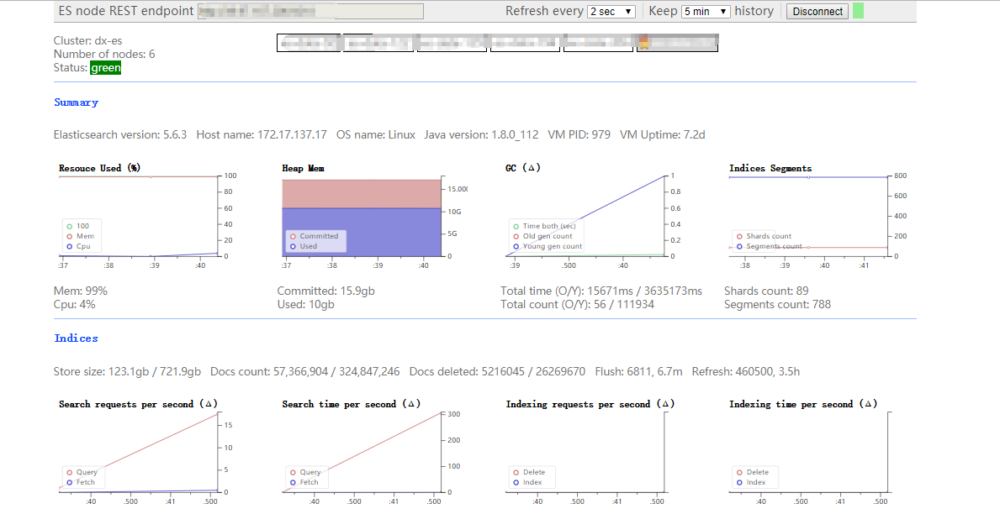
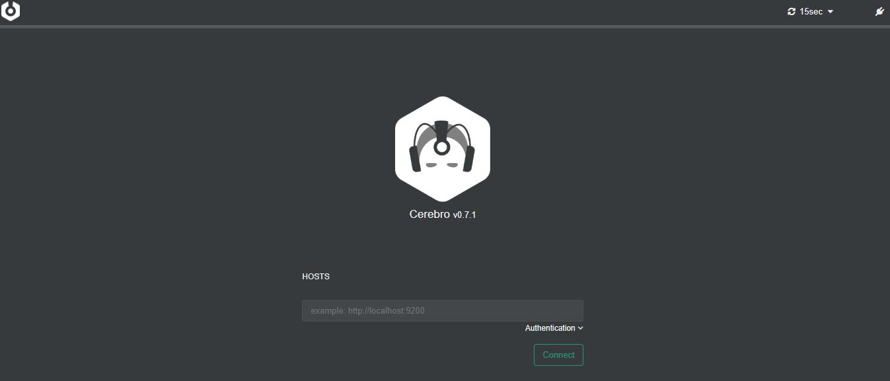
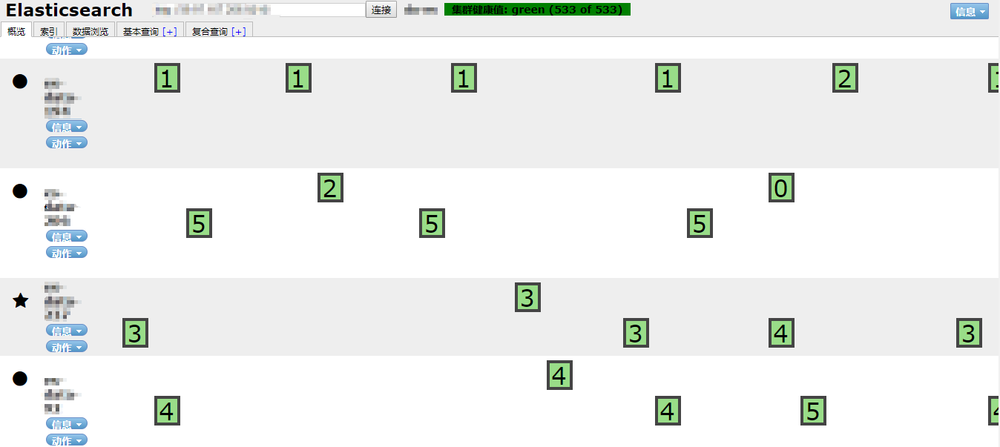

# Elasticsearch监控插件

## 一、可配置
1、集群地址
2、被监控的索引【可全部监控或者定制化监控】
3、发送报警的时间
4、发送报警的类型【发送邮件/生成报告】

## 二、报警内容
>报警模块自定义时直接使用调用接口的方式，尽量不要使用EsIndexSearch对象，因为页面重置集群地址之后后台配置的地址会失效
1、集群整体信息统计【整体资源情况，每个节点的资源情况】
2、索引信息分类统计【每个索引的信息统计】
3、按天统计索引数据量【按天统计】
4、24小时内数据删除任务的运行情况统计【删除任务运行状态监控】【24小时内无运行删除任务的索引马上报警】
5、24小时索引无新数据马上报警

## 三、WEB仪表盘
>[http://localhost:7100/es-monitor/]
1、登录界面处输入地址后续操作则直接使用这个地址
2、在配置文件配置地址后续访问非登录界面则直接使用这个地址

## 备注
1、暂时只支持HTTP访问
2、每日凌晨5点生成报告并发送邮件
3、.monitor_task_alarm只保留最近一段时间的TASK
  【每5S执行一次TASK RECORD，定期删除过时的TASK】【.monitor.task.index.retain.time选项进行配置】

## 四、集成开源插件
>除了bigdesk以外其它插件都需要下载之后以服务方式启动然后在统一管理界面访问使用http://localhost:7100/es-monitor/
>在对应模块使用相应插件需要单独输入URL地址
1、bigdesk
```shell
[http://localhost:7100/es-monitor/bigdesk-index]
```

2、cerebro - 
```shell
Download from https://github.com/lmenezes/cerebro/releases
Extract files
Run bin/cerebro(or bin/cerebro.bat if on Windows)
Access on http://localhost:9000
```

3、elasticsearch-head
```shell
Running with built in server
git clone git://github.com/mobz/elasticsearch-head.git
cd elasticsearch-head
npm install
npm run start
open http://localhost:9100/
This will start a local webserver running on port 9100 serving elasticsearch-head
```

## 五、插件图例






